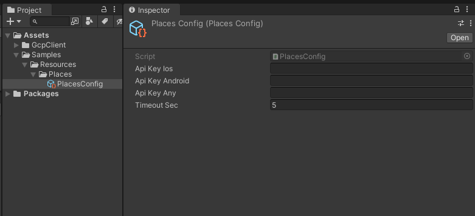

# GCP Client for Unity

Unofficial Google Cloud Platform API client for Unity.

## Features

- [Places API](https://developers.google.com/maps/documentation/places/web-service/overview)
    - Place Search
        - [ ] Find Place
        - [x] Nearby Search
        - [ ] Text Search
    - [x] Place Details
    - [x] Place Photos
    - [ ] Place Autocomplete
    - [ ] Query Autocomplete

## Setup

### Requirement

- Unity 2021.1 or higher
- UniTask 2.3.3 or higher

### Unity Package Manager

- Enter the following to install  
  | https://github.com/bigdra50/GcpClient.git?path=Assets/GcpClient

### Create Config File

- Create a ScriptableObject to specify API keys, etc. and place it in the `Resources/Places/` directory.
- Enter the API key for each platform you use or the API key you share.

